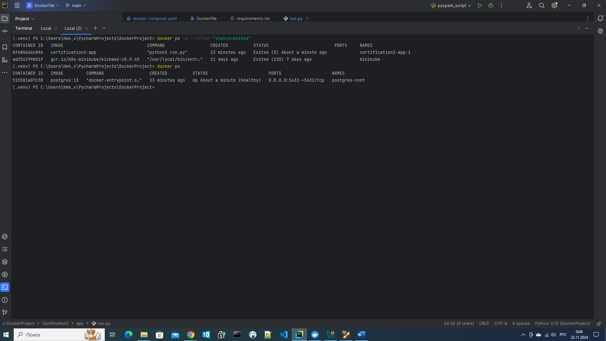
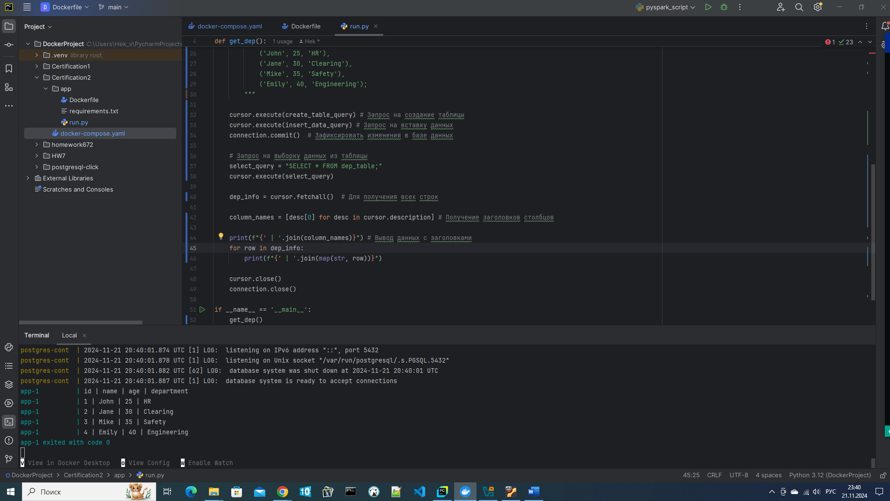

# certification 2 1T (DevOps)
## Задание 2. Создание Docker-контейнера с PostgreSQL и Python-приложением
### PostgreSQL и Python

При помощи Docker-compose создаются 2 контейнера: в первом разворачивается PostgreSQL, а во втором  — Python.
```
services:
  postgres:
    image: postgres:13
    container_name: postgres-cont
    environment:
      POSTGRES_USER: postgres
      POSTGRES_PASSWORD: password
      POSTGRES_DB: postgres
    ports:
      - "5432:5432"
    volumes:
      - local_postgres_data:/var/lib/postgresql/data
    restart: unless-stopped
    networks:
      - postgres-python
    healthcheck:
      test: ["CMD-SHELL", "pg_isready -U postgres"]
      interval: 30s
      timeout: 10s
      retries: 5
    command: postgres

  app:
    build: ./app
    volumes:
      - ./app:/app
    working_dir: /app
    networks:
      - postgres-python
    command: python3 run.py
    depends_on:
      postgres:
        condition: service_healthy
networks:
  postgres-python:
volumes:
  local_postgres_data:
```
В папке app находится Dockerfile для создания Python контейнера, зависимости requirements.txt (psycopg2-binary) и приложение run.py которое выполняет взаимодействие с базой PostgreSQL.
```
FROM python:3.9-slim
WORKDIR /app
COPY requirements.txt /app/
RUN pip install --no-cache-dir -r requirements.txt
COPY . /app
CMD ["python3", "run.py"]
```

В развернутую базу данных PostgreSQL создается таблица dep_table и вносятся данные.
Таблица и данные создаются автоматически при развертывании docker compose при помощи скрипта run.py.

```
import os
import psycopg2

def get_dep():
    connection = psycopg2.connect(
        dbname=os.environ.get('POSTGRES_DB', 'postgres'),
        user=os.environ.get('POSTGRES_USER', 'postgres'),
        password=os.environ.get('POSTGRES_PASSWORD', 'password'),
        host='postgres',
        port=5432
    )

    cursor = connection.cursor()
    create_table_query = """
        CREATE TABLE IF NOT EXISTS dep_table (
            ID SERIAL PRIMARY KEY,
            Name VARCHAR(255),
            Age SMALLINT,
            Department VARCHAR(255)
        );
        """

    insert_data_query = """
        INSERT INTO dep_table (Name, Age, Department)
        VALUES 
            ('John', 25, 'HR'),
            ('Jane', 30, 'Clearing'),
            ('Mike', 35, 'Safety'),
            ('Emily', 40, 'Engineering');
        """

    cursor.execute(create_table_query) # Запрос на создание таблицы
    cursor.execute(insert_data_query) # Запрос на вставку данных
    connection.commit()  # Зафиксировать изменения в базе данных

    # Запрос на выборку данных из таблицы
    select_query = "SELECT * FROM dep_table;"
    cursor.execute(select_query)

    dep_info = cursor.fetchall()  # Для получения всех строк

    column_names = [desc[0] for desc in cursor.description] # Получение заголовков столбцов

    print(f"{' | '.join(column_names)}") # Вывод данных с заголовками
    for row in dep_info:
        print(f"{' | '.join(map(str, row))}")

    cursor.close()
    connection.close()

if __name__ == '__main__':
    get_dep()
```

Смотрим в новом окне терминала, что приложение отработало и контейнер перешёл в status=exited, контейнер с базой PostgreSQL в status=UP:


Бежим обратно и наблюдаем результат выполнения скрипта (run.py) который выводится в терминал: 

